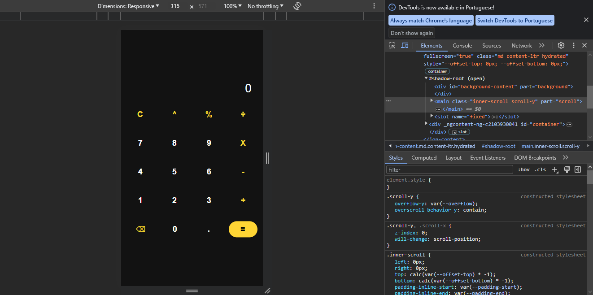

<!DOCTYPE html>
<html lang="en">
<head>
    <meta charset="UTF-8">
    <meta name="viewport" content="width=device-width, initial-scale=1.0">
</head>
<body>
  <h1> Calculadora </h1>

  

  <h2>Descrição</h2>
  
Feita para um trabalho de fim de ano da faculdade, esta calculadora foi programada com o IONIC, possuindo um visual elegante e moderno. É uma maneira de compartilhar meu trabalho e conhecimento com outras pessoas interessadas em conhecer mais sobre mim e minhas capacidades como desenvolvedor.

  <h2>Recursos e Funcionalidades</h2>
  <ul>
      <li>Visor e memória: Duas telas na parte de cima, mostrando o último e atual resultado de sua conta</li>
      <li>Operadores: Além dos operadores básicos como adição, subtração, multiplicação e divisão, a calculadora também contém expoentes e porcentagem, além da possibilidade de fazer operações com números decimais</li>
      <li>Cancelar: Botão para cancelar e redefinir todos os valores</li>
      <li>Backspace: Botão para apagar o último dígito da operação, seja ele um operador ou um número</li>
  </ul>

  <h2>Tecnologias Utilizadas</h2>
  <ul>
      <li>Linguagem TypeScript e Node</li>
      <li>Framework IONIC</li>
    </ul>

  <h2>Contato</h2>
  
Se você tiver alguma dúvida, sugestão ou quiser entrar em contato comigo, sinta-se à vontade para me enviar um e-mail em <a href="mailto:vitor.paloco@edu.unifil.com">vitor.paloco@edu.unifil.com</a> ou me encontrar em <a href="https://www.linkedin.com/in/vitor-hugo-oliveira-paloco-b64126278/">LinkedIn</a>.

</body>
</html>

